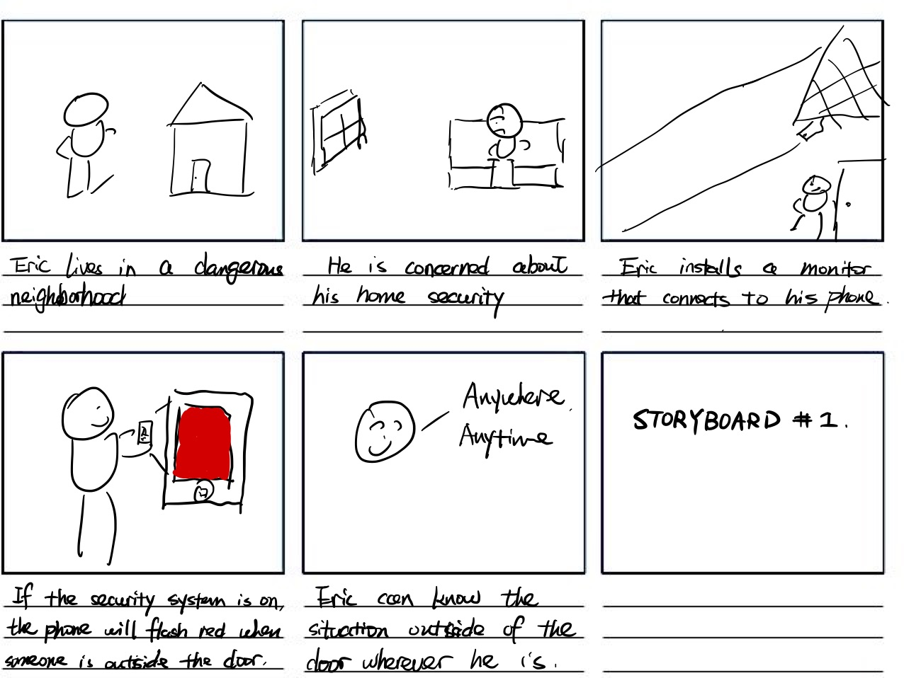
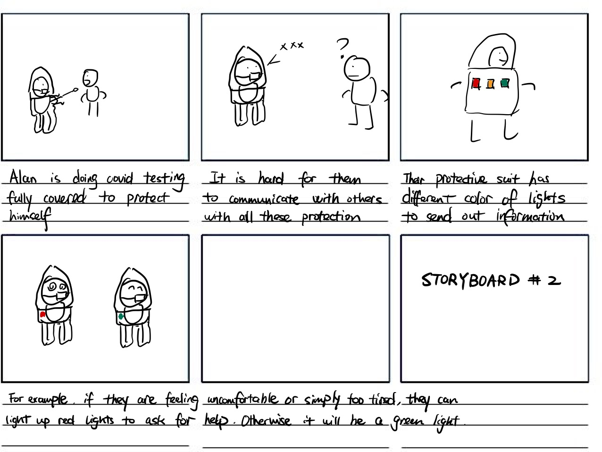
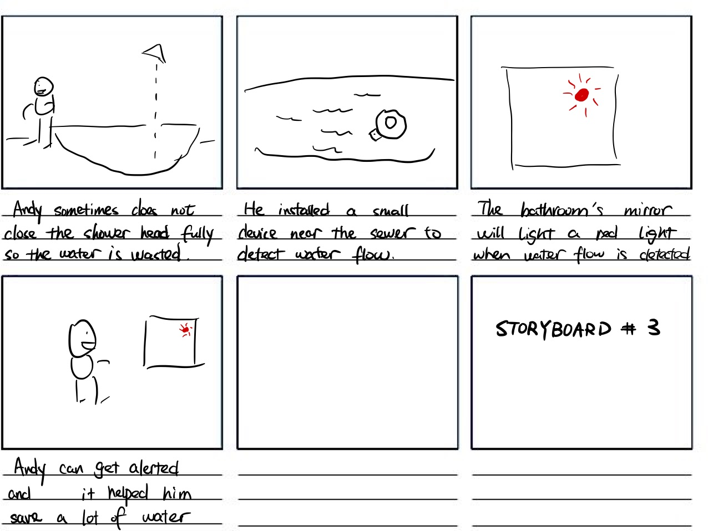
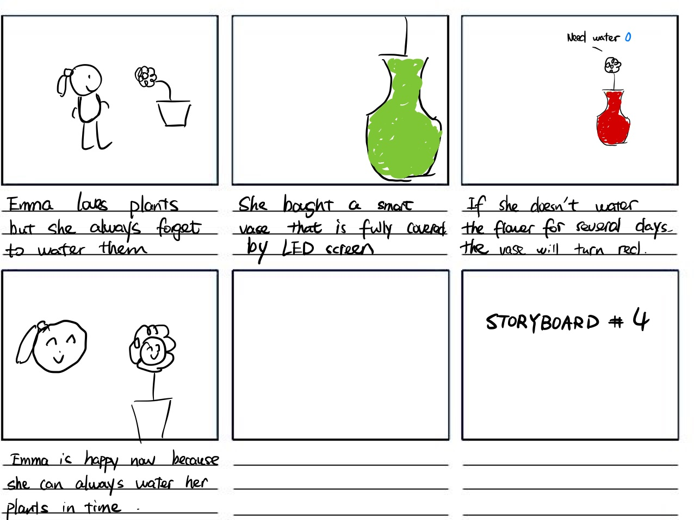
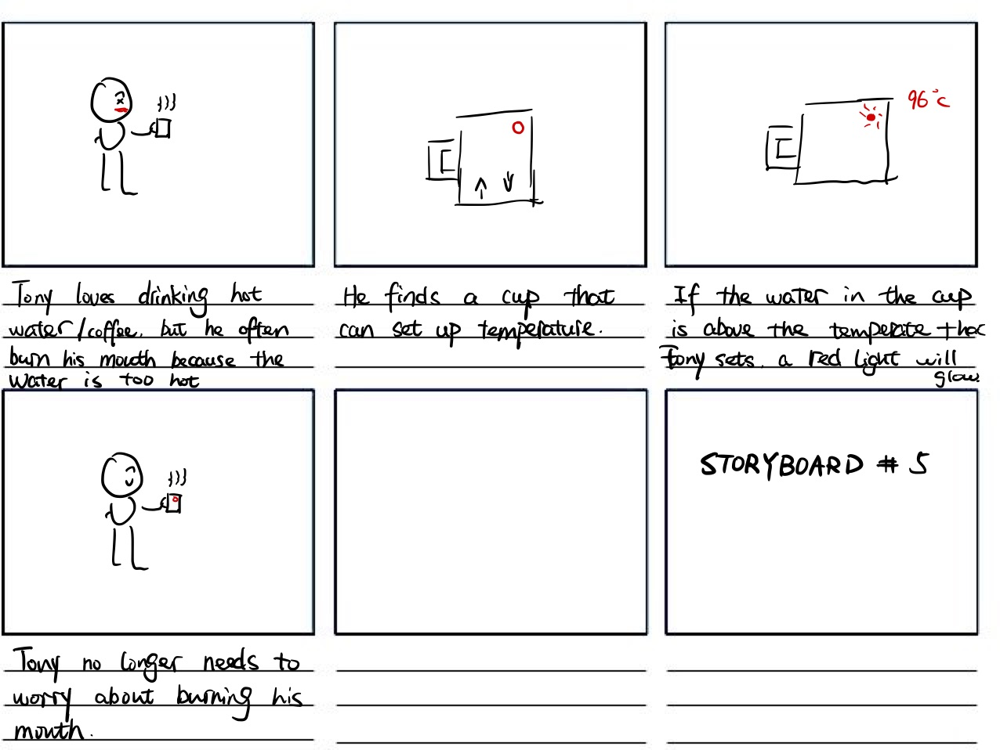
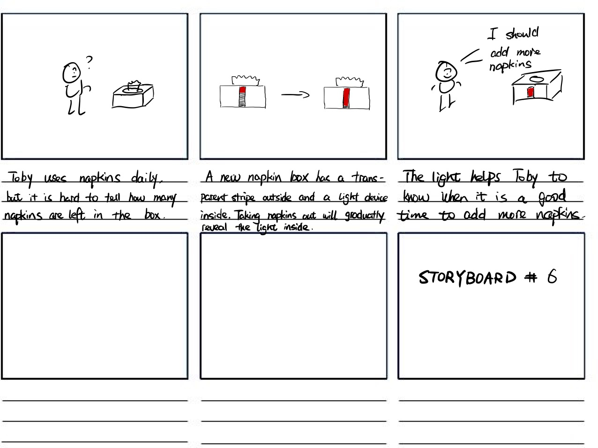
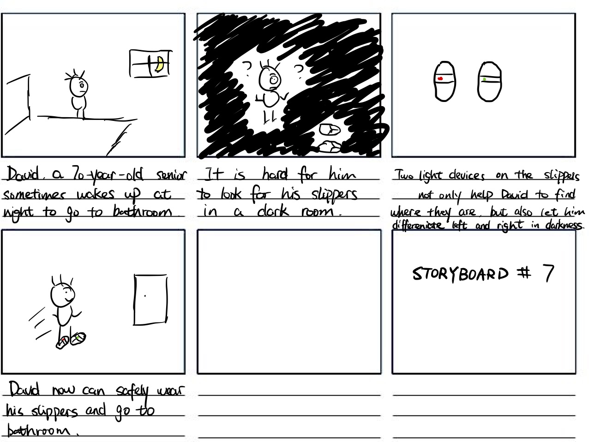
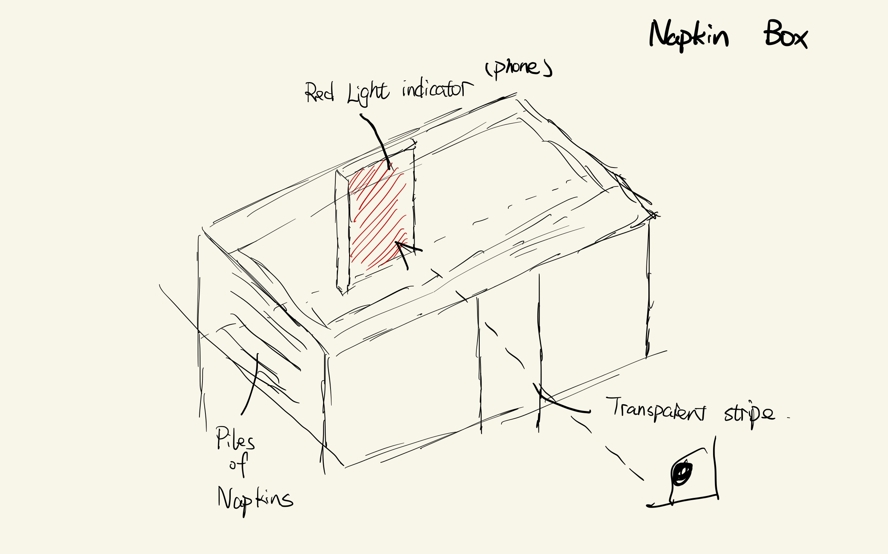
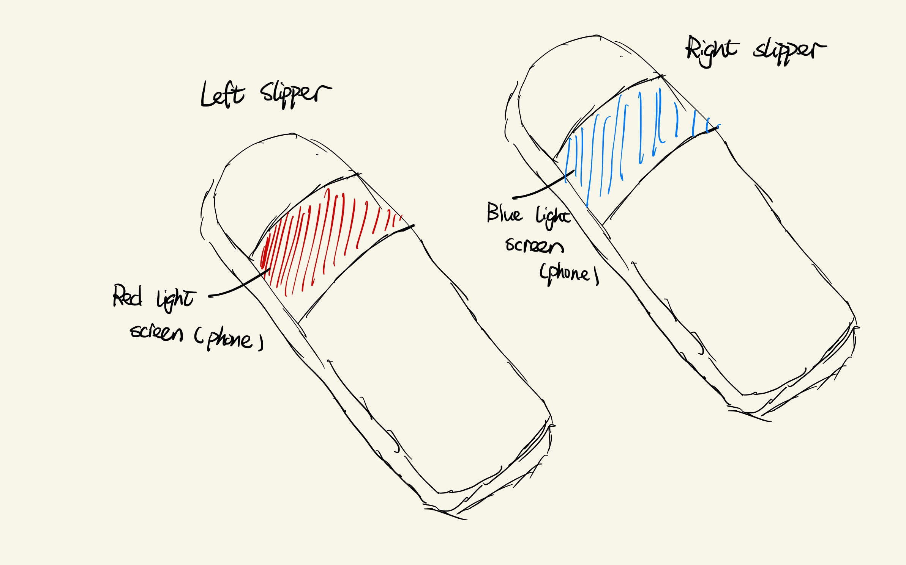
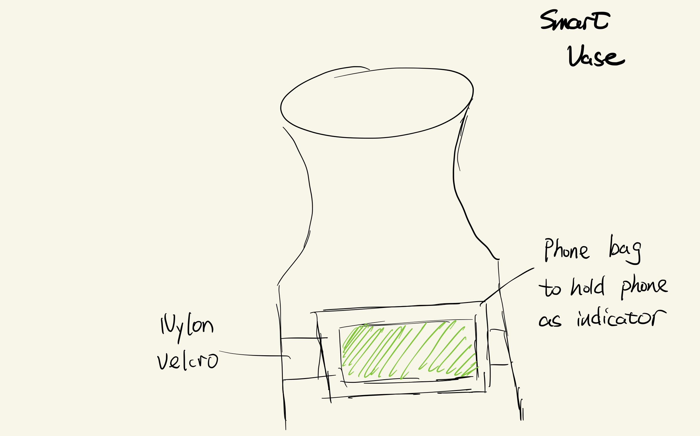

# Staging Interaction

In the original stage production of Peter Pan, Tinker Bell was represented by a darting light created by a small handheld mirror off-stage, reflecting a little circle of light from a powerful lamp. Tinkerbell communicates her presence through this light to the other characters. See more info [here](https://en.wikipedia.org/wiki/Tinker_Bell). 

There is no actor that plays Tinkerbell--her existence in the play comes from the interactions that the other characters have with her.

For lab this week, we draw on this and other inspirations from theatre to stage interactions with a device where the main mode of display/output for the interactive device you are designing is lighting. You will plot the interaction with a storyboard, and use your computer and a smartphone to experiment with what the interactions will look and feel like. 

_Make sure you read all the instructions and understand the whole of the laboratory activity before starting!_

## Prep

### To start the semester, you will need:
1. Read about Git [here](https://git-scm.com/book/en/v2/Getting-Started-What-is-Git%3F).
2. Set up your own Github "Lab Hub" repository to keep all you work in record by [following these instructions](https://github.com/FAR-Lab/Developing-and-Designing-Interactive-Devices/blob/2021Fall/readings/Submitting%20Labs.md).
3. Set up the README.md for your Hub repository (for instance, so that it has your name and points to your own Lab 1) and [learn how to](https://guides.github.com/features/mastering-markdown/) organize and post links to your submissions on your README.md so we can find them easily.

### For this lab, you will need:
1. Paper
2. Markers/ Pens
3. Scissors
4. Smart Phone -- The main required feature is that the phone needs to have a browser and display a webpage.
5. Computer -- We will use your computer to host a webpage which also features controls.
6. Found objects and materials -- You will have to costume your phone so that it looks like some other devices. These materials can include doll clothes, a paper lantern, a bottle, human clothes, a pillow case, etc. Be creative!

### Deliverables for this lab are: 
1. 7 Storyboards
1. 3 Sketches/photos of costumed devices
1. Any reflections you have on the process
1. Video sketch of 3 prototyped interactions
1. Submit the items above in the lab1 folder of your class [Github page], either as links or uploaded files. Each group member should post their own copy of the work to their own Lab Hub, even if some of the work is the same from each person in the group.

### The Report
This README.md page in your own repository should be edited to include the work you have done (the deliverables mentioned above). Following the format below, you can delete everything but the headers and the sections between the **stars**. Write the answers to the questions under the starred sentences. Include any material that explains what you did in this lab hub folder, and link it in your README.md for the lab.

## Lab Overview
For this assignment, you are going to:

A) [Plan](#part-a-plan) 

B) [Act out the interaction](#part-b-act-out-the-interaction) 

C) [Prototype the device](#part-c-prototype-the-device)

D) [Wizard the device](#part-d-wizard-the-device) 

E) [Costume the device](#part-e-costume-the-device)

F) [Record the interaction](#part-f-record)

Labs are due on Mondays. Make sure this page is linked to on your main class hub page.

## Part A. Plan 

To stage an interaction with your interactive device, think about:

_Setting:_ Where is this interaction happening? (e.g., a jungle, the kitchen) When is it happening?

_Players:_ Who is involved in the interaction? Who else is there? If you reflect on the design of current day interactive devices like the Amazon Alexa, it’s clear they didn’t take into account people who had roommates, or the presence of children. Think through all the people who are in the setting.

_Activity:_ What is happening between the actors?

_Goals:_ What are the goals of each player? (e.g., jumping to a tree, opening the fridge). 

The interactive device can be anything *except* a computer, a tablet computer or a smart phone, but the main way it interacts needs to be using light.

\*\***Describe your setting, players, activity and goals here.**\*\*

1. The interaction happens inside people's house. Players are the house owner and anyone that is detected by the security monitor around the propety. They can be visitors, package delivery guys, thieves... The players The house owner is trying to know if someone is outside the house. The people outside the door are trying to either get in the house or to leave something outside.
2. The interaction happens at the Covid-19 testing site. Players are doctors, covid test excutors, and subjects like students and travelers. 
covid test excutors are conducting covid test on subjects. The goal for test excutors is to find out if subjects has covid-19 and subjects are there to know whether they have covid-19. 
3. The interaction happens in the bathroom. Users are people who take shower. The goal is to remind the player to close the shower head and save water resource.
4. The interaction happens anywhere inside or outside of the house. Players involved are people who like planting. The activity is to water their plants and flowers. The goal of the player is to water their flowers on time to keep the plants alive.
5. The interaction can happen in an office, a house, or any indoor space in general. Players are anyone who drinks hot fluid. The goal for the player is to drink water when it is at a proper temperature to avoid buring his/her mouth. 
6. The interaction happens inside people's house. Players are basically anyone who uses napkins. The goal for the player is to know when it is a good time to add more napkins to the napkin box. 
7. The interaction happens in the bedroom close to bed. The players are usually seniors and people with bad eye sight at night. They try to find their slippers and go to the bathroom in this setting. The goal for the player is to find their slippers quickly and go to the bathroom safely. 

Storyboards are a tool for visually exploring a users interaction with a device. They are a fast and cheap method to understand user flow, and iterate on a design before attempting to build on it. Take some time to read through this explanation of [storyboarding in UX design](https://www.smashingmagazine.com/2017/10/storyboarding-ux-design/). Sketch seven storyboards of the interactions you are planning. **It does not need to be perfect**, but must get across the behavior of the interactive device and the other characters in the scene. 

\*\***Include pictures of your storyboards here**\*\*

Present your ideas to the other people in your breakout room (or in small groups). You can just get feedback from one another or you can work together on the other parts of the lab.

\*\***Summarize feedback you got here.**\*\*
1. The interaction could have more color code instead of just red. 
2. Like the idea, it's really great. But now with the covid cases cooling down, maybe consider similar uses in different contexts. 
3. The idea is great, but was confused by the sun icon on the mirror. If the water is leaking, why is there a sun icon?
4. This is a great idea, and I hope to see this in the final video. 
5. Maybe the color can have a greater area on the cup to make the indication more obvious. Also consider using different color.
6. Very practical and useful idea, maybe consider using different colors when the tissue paper is running out
7. Is the light going to light up for the entire night then? If not, are they going to find the slippers?

## Part B. Act out the Interaction

Try physically acting out the interaction you planned. For now, you can just pretend the device is doing the things you’ve scripted for it. 

\*\***Are there things that seemed better on paper than acted out?**\*\*

For the napkin box, when we are testing, the user can only see the light from the front side when they lower their view to match horizontally with the box.

For the slippers, using the phone as the light indicator is too bright for the night setting and can disturb people when they want to sleep. In the actual setting we will use small dimmed lights as indicators.

\*\***Are there new ideas that occur to you or your collaborators that come up from the acting?**\*\*

## Part C. Prototype the device

You will be using your smartphone as a stand-in for the device you are prototyping. You will use the browser of your smart phone to act as a “light” and use a remote control interface to remotely change the light on that device. 

Code for the "Tinkerbelle" tool, and instructions for setting up the server and your phone are [here](https://github.com/FAR-Lab/tinkerbelle).

We invented this tool for this lab! 

If you run into technical issues with this tool, you can also use a light switch, dimmer, etc. that you can can manually or remotely control.

\*\***Give us feedback on Tinkerbelle.**\*\*

In general it works well but as an apple user I really hope the software can have full-screen mode on iOS device. Also, maybe it is just me but the phone brower sometimes has a lag on changing colors.

## Part D. Wizard the device
Take a little time to set up the wizarding set-up that allows for someone to remotely control the device while someone acts with it. Hint: You can use Zoom to record videos, and you can pin someone’s video feed if that is the scene which you want to record. 

\*\***Include your first attempts at recording the set-up video here.**\*\*

Now, hange the goal within the same setting, and update the interaction with the paper prototype. 

\*\***Show the follow-up work here.**\*\*

## Part E. Costume the device

Only now should you start worrying about what the device should look like. Develop three costumes so that you can use your phone as this device.

Think about the setting of the device: is the environment a place where the device could overheat? Is water a danger? Does it need to have bright colors in an emergency setting?

\*\***Include sketches of what your devices might look like here.**\*\*

\*\***What concerns or opportunitities are influencing the way you've designed the device to look?**\*\*

Currently the design has to consider the fact that I am using my phone as the light device, which is big and cumbersome. If eventually we can get rid of is constraint, the light display can better merge with the iot device and make the usecase more accessible and realistic. 

## Part F. Record

\*\***Take a video of your prototyped interaction.**\*\*

<video width="320" height="240" controls>
  <source src="./napkinbox.MOV" type="video/mp4">
</video>

\*\***Please indicate anyone you collaborated with on this Lab.**\*\*
Be generous in acknowledging their contributions! And also recognizing any other influences (e.g. from YouTube, Github, Twitter) that informed your design. 

github: JMortanTan, name: Jonathan Tan, cornellId: jmt362

github: Sylv1011, name: Shuyuan Ding, cornellId: sd569

# Staging Interaction, Part 2 

This describes the second week's work for this lab activity.

## Prep (to be done before Lab on Wednesday)

You will be assigned three partners from another group. Go to their github pages, view their videos, and provide them with reactions, suggestions & feedback: explain to them what you saw happening in their video. Guess the scene and the goals of the character. Ask them about anything that wasn’t clear. 

\*\***Summarize feedback from your partners here.**\*\*

## Make it your own

Do last week’s assignment again, but this time: 
1) It doesn’t have to (just) use light, 
2) You can use any modality (e.g., vibration, sound) to prototype the behaviors! Again, be creative! Feel free to fork and modify the tinkerbell code! 
3) We will be grading with an emphasis on creativity. 

\*\***Document everything here. (Particularly, we would like to see the storyboard and video, although photos of the prototype are also great.)**\*\*
